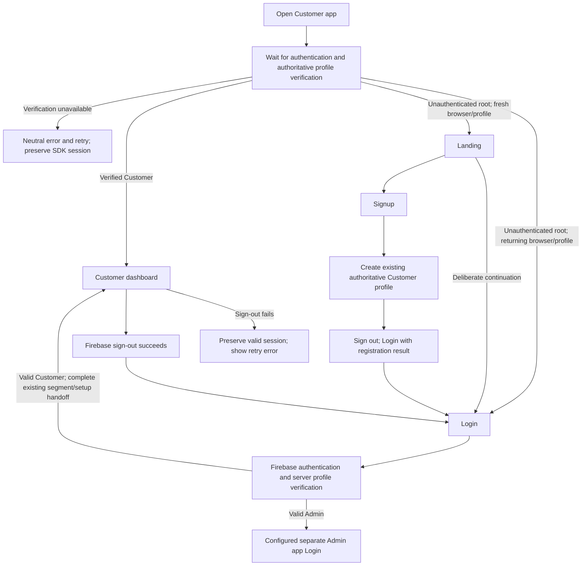
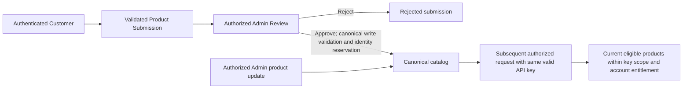
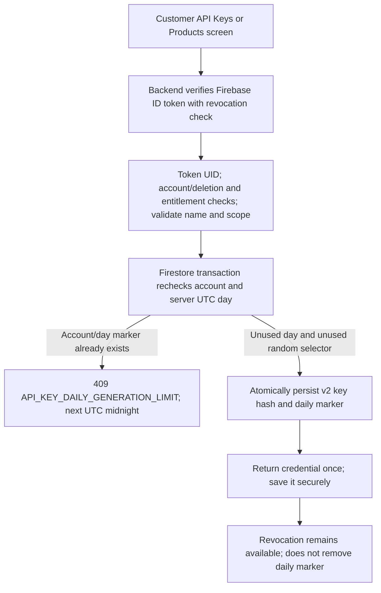
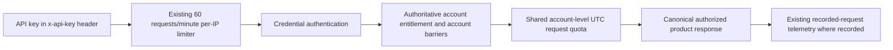
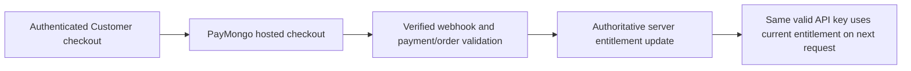
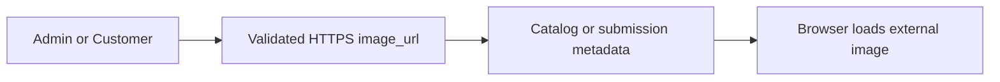

# InventaAPI — authoritative system flow

Approved R5C requirement alignment. This tracked Markdown/Mermaid is the source
of truth for the final visual/paper flowchart. It supersedes the historical
`dashboard/SYSTEM_FLOWCHART.md`. Physical printed/visual artifact: **NOT UPDATED**.
Implementation evidence is local; production certification remains outstanding.

## Entry and authentication

Landing is first visit per browser/device/profile, not once per account forever.
`inventa.landing-completed.v1` is UX-only browser storage: deliberate Landing
continuation, Login/Signup submission and Customer logout write it. Mounting
Landing alone does not. A new device/private browser or cleared/unavailable
storage may show Landing again. Successful logout always goes to Login even
when storage fails. Unauthenticated protected routes go directly to Login and
never mount protected content. Auth/role/entitlement never trusts the flag.
Admin has separate role-verified Login and protected layout; its successful
logout goes to Admin Login. Cross-origin navigation makes no SSO claim and
never passes credentials in URLs. `NEXT_PUBLIC_ADMIN_APP_ORIGIN` is an operator
production configuration gate.

## Product submission and canonical catalog

Product changes do not require regenerating a key; this is subsequent-request
freshness, not push delivery. Existing catalog reservation/import and segment
policies remain authoritative. Adding product scope to a key is not generation.

## API-key generation

Exactly one **successfully committed** generation per authenticated account per
UTC calendar day; no rolling 24-hour cooldown, no one-key maximum. Concurrent
requests contend on one deterministic marker. Validation/auth/transaction/collision
failure consumes nothing. If the transaction commits but the response is lost,
the allowance is consumed and the secret cannot be retrieved. Existing keys and
legacy handling remain valid; no historical generation backfill. All serving
backend instances must run R5C before rollout enforcement is considered active.
First post-activation success consumes that UTC day's allowance. See
[implementation and cutover details](adviser-r5c-final-requirements.md).

The successful transaction callback's backend UTC time defines the day. Conflicted
attempts write nothing; retries capture one new time for both marker and key
metadata. Production clocks must be synchronized. All key-creation backends and
marker-denial rules require a coordinated rollout; no pre-R5C instance may serve
generation traffic after activation. Marker growth/retention remains operational
work; no cleanup is introduced and current-day evidence must not be removed.

## API requests and history

Free defaults to 50 requests/day with existing lower account overrides. Pro is
5,000/day; Enterprise retains unlimited behavior. Existing request-quota cutover
hold remains independent of key generation. All keys share request usage;
generation neither consumes nor resets it. Customer history is still at most 50
recent recorded API requests, not complete quota accounting or key-generation
history. **Key Name** is the key alias at request time; no downstream Consumer
registry or invented Consumer identity.

## Payment and entitlement

Browser plan selections and payment redirects are intent/display only, never
payment proof. Existing lifecycle expiry, renewal and deletion barriers remain.
Free Trial is **DEFERRED / OUT OF SCOPE**. PayMongo sandbox verification remains
a release gate; no live payment calls were made for R5C.

## Images

URL-only images are the accepted architecture: simpler operation, no upload
lifecycle, and no introduction of Firebase Storage object/egress costs for
product-image hosting. External image hosting is not assumed free. No Firebase
Storage upload flow, object migration, or activation/deployment of dormant
`storage.rules` is included. Existing URL validation and media monitoring remain.

## Release readiness remains separate

Admin traffic permission gap: **CLOSED AT CODE LEVEL** by the authenticated,
Admin-authorized bounded backend sample in [R6A](adviser-r6a-admin-traffic.md).
Telemetry browser reads/writes remain denied. Production validation and Admin
traffic scale remain open. Remaining gates: history composite index deployment; actual
Customer/Admin/API origins and provider targets; Node 22 provider compatibility;
sibling reporting-source packaging; production secrets/config; coordinated
`API_QUOTA_CUTOVER_AT`; runtime timezone; catalog/report/history scale; R3 audit,
conflict resolution, reservation backfill and write freeze/rollout; PayMongo
sandbox; deployed-origin browser E2E; release certification. No production hostname
or deployment command is invented here. All original-list product decisions are
resolved; these release gates are not claimed complete.
